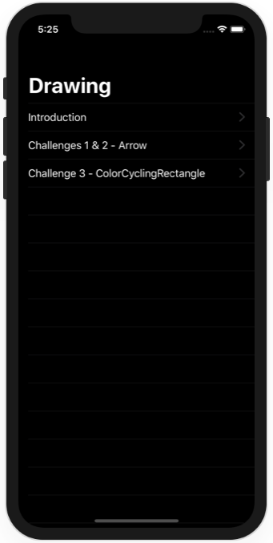
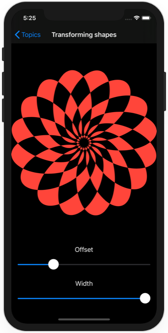
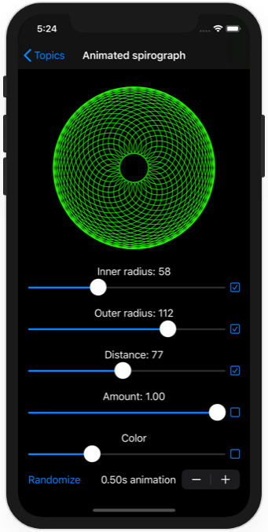
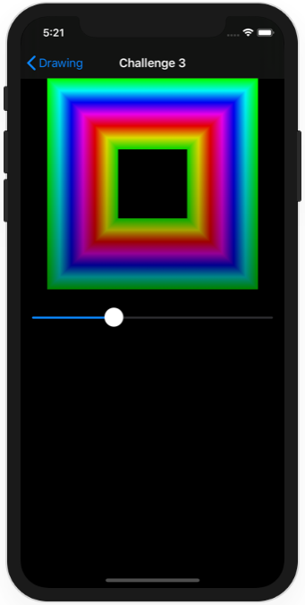

# Project 9 - Drawing

https://www.hackingwithswift.com/100/swiftui/43

Includes solutions to the [challenges](https://www.hackingwithswift.com/books/ios-swiftui/drawing-wrap-up).

## Topics

Paths, shapes, strokes, transforms, drawing groups, animating values, Core Animation, Metal

## Challenges

From [Hacking with Swift](https://www.hackingwithswift.com/books/ios-swiftui/drawing-wrap-up):
>1. Create an Arrow shape made from a rectangle and a triangle – having it point straight up is fine.
>2. Make the line thickness of your Arrow shape animatable.
>3. Create a ColorCyclingRectangle shape that is the rectangular cousin of ColorCyclingCircle, allowing us to control the position of the gradient using a property.

## Screenshots

